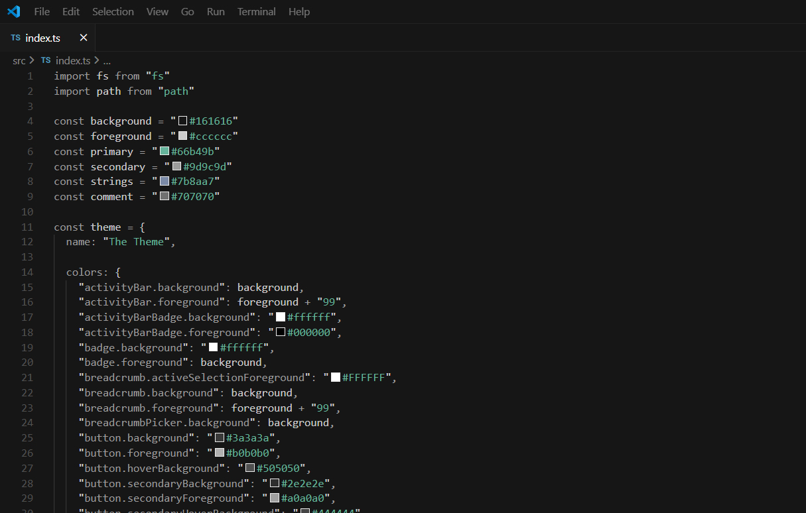

# The Theme



# Manual installation (theme builder)

This is a custom theme builder and installer for Visual Studio Code / Cursor / Windsurf: https://github.com/mazhugasergei/theme-builder. With it you can edit the theme and install it locally.

Install dependencies:

```bash
npm install
```

## Auto Install

For all installed editors:

```bash
npm run reinstall:all
```

Or individually:

```bash
npm run reinstall:code
npm run reinstall:cursor
npm run reinstall:windsurf
```

## Manual Install

### 0. Clean the build if needed

```bash
npm run clean
```

### 1. Build the theme file

```bash
npm run build
```

### 2. Install the theme extension to all installed editors

```bash
npm run install:all
```

Or individually:

```bash
npm run install:code
npm run install:cursor
npm run install:windsurf
```

### Uninstall the theme extension from all installed editors

```bash
npm run uninstall:all
```

Or individually:

```bash
npm run uninstall:code
npm run uninstall:cursor
npm run uninstall:windsurf
```
